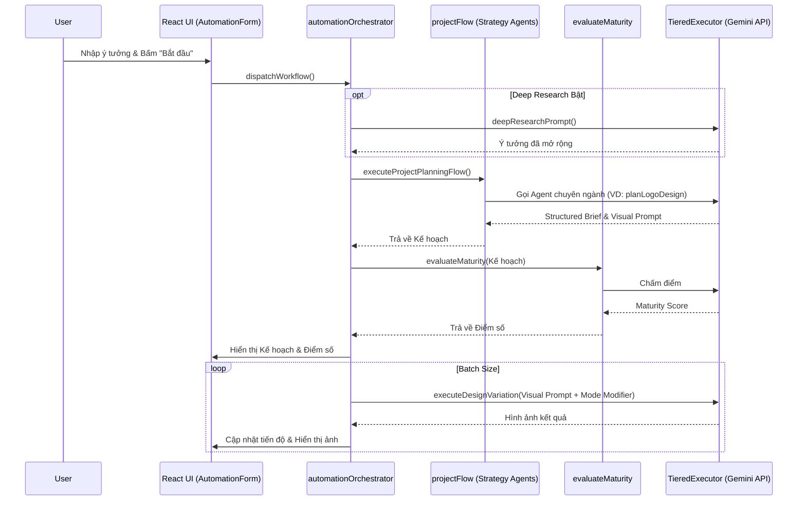

# Kiến trúc Hệ thống (System Architecture)

Tiệm Ảnh Tức Thời (Visual Empathy Assistant) v11.0 sử dụng kiến trúc **Agentic Workflow** và **Intelligent Pipeline** tiên tiến, biến ứng dụng thành một Creative Agency thu nhỏ.

---

## 1. Tổng quan Kiến trúc (High-Level Architecture)

Hệ thống được chia thành các tầng (Layers) rõ ràng:

1. **Presentation Layer (React/Tailwind):** Giao diện người dùng, xử lý tương tác, hiển thị kết quả.
2. **Orchestration Layer (Intelligent Pipeline):** Điều phối luồng công việc, định tuyến tác vụ.
3. **Agent Layer:** Các tác tử AI chuyên biệt (Strategy, Visual, Audit, Video).
4. **Execution Layer (Tiered Executor):** Quản lý hàng đợi, giới hạn tốc độ (Rate Limiting), gọi API an toàn.
5. **Foundation Model Layer:** Google Gemini 3.1 Pro, Gemini 3.1 Flash, Gemini 3.1 Flash Image, Veo 3.1.

---

## 2. Intelligent Pipeline (Luồng tự động hóa thông minh)

Khi người dùng bắt đầu một dự án tự động (Automation Workflow), hệ thống không chỉ đơn thuần gọi API sinh ảnh mà trải qua một quy trình 4 bước chặt chẽ:

### Bước 1: Deep Research (Nghiên cứu sâu)
*   **Mục đích:** Mở rộng ý tưởng thô của người dùng thành một ngữ cảnh đầy đủ.
*   **Cơ chế:** Nếu người dùng bật tính năng "Nghiên cứu sâu", hệ thống gọi hàm `deepResearchPrompt` sử dụng **Gemini 3.1 Pro** với `ThinkingLevel.HIGH`.
*   **Kết quả:** Một prompt chi tiết, kết hợp thông tin Branding (màu sắc, phong cách) và các yếu tố chuyên ngành.

### Bước 2: Strategic Planning (Lập kế hoạch chiến lược)
*   **Mục đích:** Lập bản tóm tắt chiến lược (Structured Brief) và tối ưu hóa Visual Prompt.
*   **Cơ chế:** `projectFlow.ts` đóng vai trò như một Router, tự động gọi đúng Agent chuyên gia dựa trên danh mục (Category).
    *   *Ví dụ:* `planLogoDesign` cho Logo, `planPackagingProject` cho Bao bì, `planMarketingCampaign` cho Quảng cáo.
*   **Kết quả:** Bản chiến lược chuyên sâu và Prompt vẽ ảnh đã được tối ưu hóa.

### Bước 3: Pre-Audit (Thẩm định chất lượng)
*   **Mục đích:** Đảm bảo bản kế hoạch khả thi và đạt tiêu chuẩn trước khi tốn tài nguyên render.
*   **Cơ chế:** Hàm `evaluateMaturity` đánh giá bản tóm tắt chiến lược và trả về điểm số (Maturity Score).
*   **Kết quả:** Điểm số và nhận xét được hiển thị ngay lập tức cho người dùng.

### Bước 4: Context-Aware Execution (Thực thi Render)
*   **Mục đích:** Sinh ảnh hàng loạt (Batch Generation) dựa trên kế hoạch đã duyệt.
*   **Cơ chế:** Sử dụng **Gemini 3.1 Flash Image**. Hệ thống tự động chèn các "Mode Modifiers" (ví dụ: `[PAGE 1/40]`, `[ASSET VARIATION 1]`) vào prompt để đảm bảo các ảnh trong cùng một batch có sự nhất quán nhưng vẫn đa dạng đúng mục đích.

---

## 3. Tiered Executor (Quản lý hàng đợi & Tài nguyên)

Để đảm bảo an toàn kinh tế (Economic Safety) và tránh lỗi Rate Limit từ API, mọi tác vụ gọi AI đều phải đi qua `executeManagedTask` trong `lib/tieredExecutor.ts`.

Các Tier (Cấp độ) được định nghĩa:
*   **ANALYSIS_FAST:** Các tác vụ phân tích nhanh (Gemini 3.1 Flash).
*   **STRATEGY_PLANNING:** Các tác vụ lập kế hoạch sâu (Gemini 3.1 Pro).
*   **IMAGE_GEN_BATCH:** Sinh ảnh hàng loạt (Gemini 3.1 Flash Image).
*   **IMAGE_GEN_4K:** Sinh ảnh độ phân giải cao, tốn nhiều tài nguyên.
*   **VIDEO_GEN:** Sinh video (Veo 3.1) - Yêu cầu khóa an toàn (Mutex Lock) nghiêm ngặt nhất.

Mỗi Tier có cấu hình riêng về số lượng request đồng thời (Concurrency) và thời gian chờ (Timeout).

---

## 4. Sơ đồ Luồng dữ liệu (Data Flow)

---

## 5. Tiêu chuẩn Mã nguồn (Coding Standards)

*   **Tách biệt Concerns:** Logic UI nằm trong `features/`, logic điều phối nằm trong `services/flows/`, logic gọi API nằm trong `services/orchestrator/` và `services/pixel/`.
*   **Xử lý lỗi:** Mọi tác vụ gọi API đều được bọc trong `callWithRetry` để tự động thử lại khi gặp lỗi mạng hoặc Rate Limit.
*   **Bảo mật:** API Key không bao giờ được lưu trữ trong client state, chỉ được đọc từ biến môi trường hoặc cấu hình an toàn.
